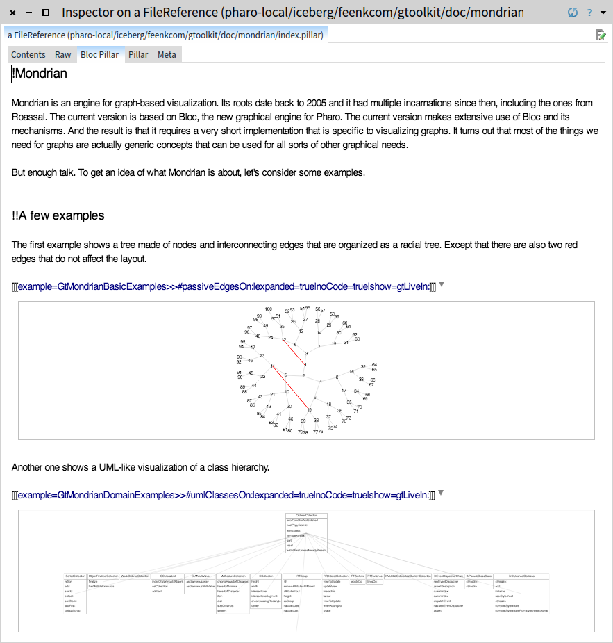
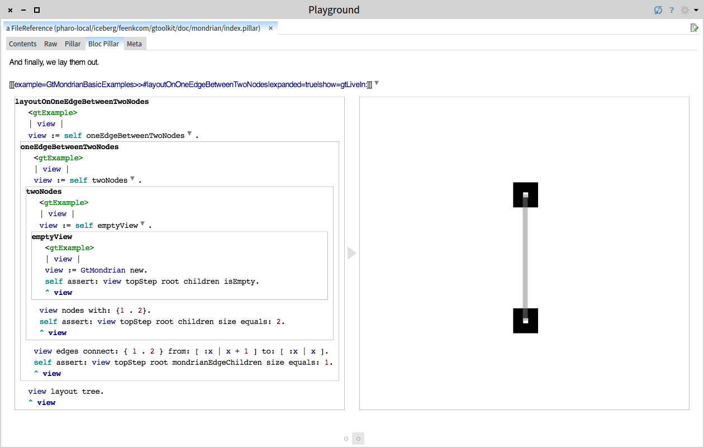
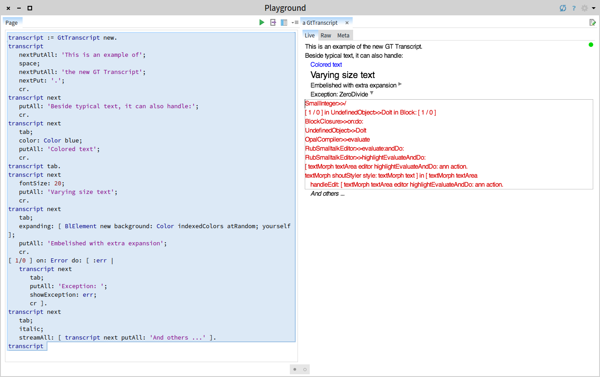

# The Glamorous Toolkit (GT)
GT is the moldable IDE for Pharo. The main goal of GT is to redefine the experience of developing software.

The current repository embodies the second generation of GT that is based on the [Bloc project](https://github.com/pharo-graphics/Bloc) and it is comprised of a set of distinct tools. Currently these are:
- [Inspector](https://github.com/feenkcom/gtoolkit-inspector): the moldable inspector for Pharo on top of Bloc.
- Documenter: a tool for showing live documentation inside Pharo. It is based on Pillar and on the moldable text editor.
- Transcript: a rethinking of the classic Transcript taking advantage of the moldable text editor from Bloc.
- [Visualizer](https://github.com/feenkcom/gtoolkit-visualizer): a set of visualization engines on top of Bloc.
- [Examples](https://github.com/feenkcom/gtoolkit-examples): an engine for example-driven development in Pharo.


## How to load

You can load the whole code in Pharo 6.1 using the following snippet:

```
Metacello new
   baseline: 'GToolkit';
   repository: 'github://feenkcom/gtoolkit/src';
   load.
```

Alternatively, you can also load each individual tools separately using the corresponding baselines.

## Details

### GT Documenter

The Documenter is a tool for creating and consuming live documents directly in the development environment. The interaction happens seamlessly directly in the text editor and it can be combined with different types of previews to serve several use cases.

For example, Documenter can embed pictures right in place:



And it can even embed live code that can be previewed in place:




### GT Transcript

Transcript offers a rich and interactable text interface for displaying live information coming from a system.

The API is backward compatible with the existing transcript. To enable the new features, we introduced a builder. For example, `transcript nextPutAll: 'something'` becomes `transcript next putAll: 'something'`, and after `next` we can add multiple attributes that we want to affect the following insertion of a text. The API can be seen in the following picture:



To get an idea of how this tool can be useful, take a look at the following video showing the visual logging of a Bloc animation:

[](https://youtu.be/9VATYNaLwJY "GT Transcript: logging an animation")
